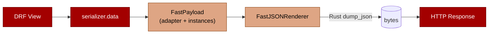

# drf-fastserializers

**DRF serializers, pydantic-core inside.**

<p>
  <a href="https://pypi.org/project/drf-fastserializers/"></a>
  
  
  
  
  
  <a href="https://github.com/astral-sh/ruff"></a>
</p>

> **2-3x faster `.data` on existing endpoints. One line added.**

Drop `FastSerializerMixin` into your existing serializer and `.data`
switches to pydantic-core's Rust JSON encoder. No rewrite. Same DRF
surface.

```python
from rest_framework import serializers
from drf_fastserializers import FastSerializerMixin, FastJSONRenderer

class TxnSerializer(FastSerializerMixin, serializers.ModelSerializer):
    class Meta:
        model = Txn
        fields = ["id", "name", "amount", "txn_date"]

class TxnListView(ListAPIView):
    serializer_class = TxnSerializer       # unchanged
    renderer_classes = [FastJSONRenderer]  # add this
    queryset = Txn.objects.all()
```

That's the migration. If `TxnSerializer` translates cleanly the endpoint
gets the speedup on the next request. `SerializerMethodField`s with a
`-> T` return annotation are translated automatically; un-annotated
getters work but render through a slower pydantic path until you add
one. If translation truly fails (a custom `Field` with no scalar
mapping), you get a one-time warning and `.data` falls back to standard
DRF. The endpoint keeps working either way.

## Benchmark

<p align="center">
  
</p>

<details>
<summary>Full table</summary>

21,393 synthetic rows, ~3 MB JSON, 5 runs each.
Python 3.12, pydantic 2.13, DRF 3.17.

| Strategy | median_ms | min_ms | speedup |
|---|---:|---:|---:|
| DRF `Serializer` (stock) | 96 | 96 | 1.00x |
| **drf-fastserializers (mixin)** | **37** | 35 | **2.64x** |
| **drf-fastserializers (native)** | **36** | 34 | **2.65x** |
| Raw dict via `JSONRenderer` (reference floor, no validation) | 20 | 20 | 4.80x |

</details>

Speedup is anchored on stock DRF. Reproduce on your hardware:

```bash
uv run python -m benchmarks.bench         # text output
uv run python -m benchmarks.plot          # regenerate docs/bench.svg
```

`benchmarks/bench.py` ships with the repo and uses synthetic data only.
Real-world gaps widen further on `ModelSerializer` paths (because of
ORM hydration overhead) and on payloads with nested models. In
production workloads we've seen 3-4x speedups on `ModelSerializer`
endpoints.

## Install

```bash
uv add drf-fastserializers
# or
pip install drf-fastserializers
```

Requires Python 3.12+, pydantic 2.7+ (v3 supported), DRF 3.14+.

## How it compares

|  | stock DRF | drf-pydantic | django-ninja | **drf-fastserializers** |
|---|:---:|:---:|:---:|:---:|
| Drop into existing DRF generics | ✅ | ✅ | ❌ | ✅ |
| Rust JSON encode (pydantic-core) | ❌ | ❌ | ✅ | ✅ |
| Migrate one endpoint at a time | ✅ | ✅ | ❌ | ✅ |
| Keeps DRF auth / perms / throttling | ✅ | ✅ | ❌ | ✅ |
| Strictly typed schemas | ❌ | ✅ | ✅ | ✅ |
| No serializer rewrite required | ✅ | ❌ | ❌ | ✅ |

`drf-pydantic` generates DRF serializers from pydantic models, which
keeps DRF in the request path and gives no speed win. `django-ninja`
replaces DRF wholesale. `drf-fastserializers` swaps only the encoder
inside DRF, so you keep the rest of your stack and migrate per
endpoint.

## Migrating an existing serializer

### Drop in the mixin

```python
from drf_fastserializers import FastSerializerMixin

class TxnSerializer(FastSerializerMixin, serializers.ModelSerializer):
    class Meta:
        model = Txn
        fields = ["id", "name", "amount", "txn_date"]
```

`FastSerializerMixin` must come **first** in the MRO. On the first
`.data` access it translates the DRF field list into a pydantic schema,
caches it per class, and switches `.data` to the Rust path. `many=True`
is handled via a `FastListSerializer` wrapper installed automatically.

### Add the renderer

```python
REST_FRAMEWORK = {
    "DEFAULT_RENDERER_CLASSES": [
        "drf_fastserializers.FastJSONRenderer",
    ],
}
```

`FastJSONRenderer` subclasses `JSONRenderer` and falls back to stock
encoding for error responses, hand-rolled dicts, the browsable API, and
anything else it doesn't recognize. Safe as a project-wide default. Set
`renderer_classes` per view if you want to roll it out gradually.

### SerializerMethodField

Auto-translated. The bound `get_*` method runs once per row at validate
time against the **source object** (Django model, dict, ...), and the
result lands in a regular pydantic field that the Rust render path
encodes.

```python
class TxnSerializer(FastSerializerMixin, serializers.ModelSerializer):
    formatted_amount = serializers.SerializerMethodField()

    def get_formatted_amount(self, obj) -> str:
        return f"${obj.amount:,.2f}"
```

Add the `-> T` return annotation. Without it the field falls back to
`Any` (the field still renders correctly, but pydantic's Rust-side type
validation is bypassed; you'll see a one-time warning).

SMFs that hit the ORM remain *your* responsibility — the auto path
gives you the field, not the query plan. Prefetch / annotate at the
queryset level to avoid N+1.

If the result really can't be derived from the source object, drop the
SMF on the way through `from_drf` and replace it with a pydantic
`@computed_field`:

```python
from drf_fastserializers import from_drf

FastTxnOut = from_drf(
    TxnSerializer,
    computed={
        "formatted_amount": (lambda self: f"${self.amount:,.2f}", str),
    },
)
```

The callable receives the validated pydantic instance (so it can read
already-resolved fields like `self.amount`) and the second tuple
element is the return annotation.

### When auto-translation fails

Custom `Field` subclasses with an overridden `to_representation` that
isn't in the scalar table can't be auto-mapped. The mixin emits a
one-time warning and falls back to standard DRF `.data`. Two fixes:

**1. Switch to explicit translation** via `from_drf(TxnSerializer,
exclude=("weird_field",))` and redeclare the field manually on the
resulting `FastSerializer`.

**2. Opt out for this serializer.** Set `Meta.fast = False`. The mixin
stops trying, the warning goes away, and the endpoint stays on DRF.

### Field mapping

<details>
<summary>Full DRF to pydantic field mapping table</summary>

| DRF field | Pydantic type |
|---|---|
| `CharField`, `EmailField`, `URLField`, `SlugField`, `RegexField` | `str` |
| `IntegerField` | `int` |
| `FloatField` | `float` |
| `DecimalField` | `Decimal` |
| `BooleanField` | `bool` |
| `DateField` / `DateTimeField` / `TimeField` / `DurationField` | `date` / `datetime` / `time` / `timedelta` |
| `UUIDField` | `UUID` |
| `IPAddressField`, `FileField`, `ImageField` | `str` |
| `ChoiceField` | `str` |
| `JSONField` | `Any` |
| `ReadOnlyField` | `Any` (no type info to extract; output renders as-is) |
| `DictField`, `HStoreField` | `dict` |
| `ListField(child=X)` | `list[mapped(X)]` |
| `Serializer(...)` (nested) | nested `FastSerializer` (recursive) |
| `ListSerializer(...)` | `list[nested FastSerializer]` |
| `PrimaryKeyRelatedField` | `int` |
| `StringRelatedField`, `HyperlinkedRelatedField`, `SlugRelatedField` | `str` |
| `SerializerMethodField` | annotated return type of `get_*` method (falls back to `Any`) |

Field options carried through:

| DRF option | Effect on pydantic field |
|---|---|
| `required=False` | non-required with `default=None` (or empty container for `ListField`/`DictField`) |
| `allow_null=True` | type widened to `T \| None` |
| `default=...` | becomes the pydantic default |
| `source="a.b.c"` | becomes `AliasPath("a", "b", "c")` |

</details>

### Pagination

Standard DRF pagination works without changes:

```python
class TxnListView(ListAPIView):
    serializer_class = TxnSerializer
    renderer_classes = [FastJSONRenderer]
    pagination_class = LimitOffsetPagination
    queryset = Txn.objects.all()
```

The renderer recognizes `{"results": <FastPayload>, "next": ..., "count": ...}`
and splices the Rust-encoded list bytes into the paginator's wrapper.

## Deriving schemas from Django models

When you'd rather skip the DRF serializer step entirely, derive a
schema straight from your Django model:

```python
from drf_fastserializers import from_model, FastJSONRenderer

TxnOut = from_model(Txn, fields=["id", "name", "amount", "txn_date"])

class TxnListView(ListAPIView):
    serializer_class = TxnOut.drf
    renderer_classes = [FastJSONRenderer]
    queryset = Txn.objects.all()
```

`from_model` walks `Model._meta` and maps each concrete Django field to
its pydantic equivalent (nullability, defaults, FK PK types, callable
defaults via `default_factory`). Pass `fields="__all__"` to include
every concrete field, or `exclude=(...)` to drop a subset.

## Defining schemas natively (new code)

For new endpoints, skip the DRF serializer and define a pydantic schema
directly. Same renderer, tighter types, less boilerplate.

```python
from datetime import date
from decimal import Decimal
from drf_fastserializers import FastSerializer, FastJSONRenderer

class Flags(FastSerializer):
    is_nsf: bool = False
    is_refund: bool = False

class TxnOut(FastSerializer):
    id: int
    name: str
    amount: Decimal | None = None
    txn_date: date
    flags: Flags
    tags: list[str] = []

class TxnListView(ListAPIView):
    serializer_class = TxnOut.drf
    renderer_classes = [FastJSONRenderer]
    queryset = Txn.objects.all()
```

`FastSerializer` is a `pydantic.BaseModel`. Everything pydantic does
(nested models, `@computed_field`, validators, `model_config`, enums)
works.

`TxnOut.drf` is a class-level descriptor returning a `DRFAdapter`
subclass bound to the schema. It quacks like
`rest_framework.serializers.Serializer`:

```python
serializer = TxnOut.drf(instance=qs, many=True)
serializer.data            # FastPayload, encoded on render
serializer.is_valid()      # validates incoming request data
serializer.errors          # DRF-shape: {"field": ["msg", ...]}
serializer.validated_data  # pydantic instances
```

Input validation in a view:

```python
class TxnCreateView(APIView):
    def post(self, request):
        serializer = TxnIn.drf(data=request.data)
        serializer.is_valid(raise_exception=True)
        txn = serializer.validated_data
        Txn.objects.create(**txn.model_dump())
        return Response(status=201)
```

Errors land in DRF's standard shape:

```json
{
  "amount": ["Input should be a valid decimal"],
  "flags.is_nsf": ["Input should be a valid boolean"]
}
```

### Partial updates

Pass `partial=True` at construction (matches DRF). Every field becomes
optional with default `None`, and
`validated_data.model_dump(exclude_unset=True)` returns only the keys
the client actually sent.

```python
class TxnPatchView(APIView):
    def patch(self, request, pk):
        serializer = TxnIn.drf(data=request.data, partial=True)
        serializer.is_valid(raise_exception=True)
        Txn.objects.filter(pk=pk).update(
            **serializer.validated_data.model_dump(exclude_unset=True)
        )
        return Response(status=200)
```

### Rust input path with `FastJSONParser`

Stock DRF parses JSON into a Python dict, then `is_valid` re-walks that
dict to validate it. `FastJSONParser` skips the first pass and hands
raw request bytes directly to pydantic-core's `validate_json`. Add it
to `parser_classes` per view, or to `DEFAULT_PARSER_CLASSES` globally.

```python
class TxnCreateView(APIView):
    parser_classes = [FastJSONParser]
    renderer_classes = [FastJSONRenderer]

    def post(self, request):
        serializer = TxnIn.drf(data=request.data)
        serializer.is_valid(raise_exception=True)
        Txn.objects.create(**serializer.validated_data.model_dump())
        return Response(status=201)
```

Middleware or tests that read `request.data` still get a dict. The
parser returns a lazy-decoded proxy that triggers `json.loads` on the
first non-validator access.

### `values_fields()` projection helper

Spell the queryset projection once, on the schema:

```python
qs = Txn.objects.values(*TxnOut.values_fields())
```

Returns the field names declared on `TxnOut` in declaration order.
Pass `exclude=(...)` to drop specific fields.

### Explicit factory

Prefer an explicit import over the `.drf` descriptor? Use `drf_serializer`:

```python
from drf_fastserializers import drf_serializer

class TxnListView(ListAPIView):
    serializer_class = drf_serializer(TxnOut)
```

Both forms return the same cached `DRFAdapter` subclass.

## OpenAPI schemas via drf-spectacular

Install the extra and import the extension module once during app
startup, typically in your `AppConfig.ready()`:

```bash
pip install 'drf-fastserializers[spectacular]'
```

```python
# myapp/apps.py
class MyAppConfig(AppConfig):
    name = "myapp"

    def ready(self):
        import drf_fastserializers.spectacular  # noqa: F401
```

Every `FastSerializer`-backed view is then rendered into the OpenAPI
schema using `model_json_schema()`. Nested models, enum choices,
validators, and `@computed_field`s all carry through. No
`@extend_schema` boilerplate needed for the common case.

## How it works

Stock DRF serializers iterate field objects in Python on every
response. That overhead dominates response time for endpoints returning
thousands of rows.

`drf-fastserializers` skips DRF's field pipeline. On `.data` access the
serializer hands back a `FastPayload` marker carrying the validated
pydantic instances plus a `TypeAdapter`. `FastJSONRenderer` recognizes
the marker and routes encoding to `TypeAdapter.dump_json`, which is
implemented in Rust as part of
[pydantic-core](https://github.com/pydantic/pydantic-core). Bytes go
straight to the HTTP response. No Python-side `json.dumps` step.



For payloads the renderer doesn't recognize (error responses, plain
dicts, the browsable API, paginated wrappers), it falls back to stock
`JSONRenderer`. The library never breaks code paths it doesn't
explicitly handle.

## Pydantic v2 and v3

Built against the stable pydantic surface used by both v2.7+ and v3.x
(`BaseModel`, `TypeAdapter`, `ConfigDict`, `ValidationError`,
`model_dump_json`). The pyproject spec is `pydantic>=2.7,<4`. The
`PYD_V3` flag is exposed for downstream code that needs to branch.

## What this library is *not*

* Not a `ModelSerializer` replacement that auto-infers fields from a
  Django model. Use `from_drf(MyModelSerializer)` to lift an existing
  one, or declare fields explicitly in a `FastSerializer`.
* Not a framework. Keep your DRF generics, viewsets, routers,
  permissions, auth backends, throttling, filtering. Only the
  serializer and renderer paths change. Migrate one endpoint at a time.
* Not a drf-spectacular replacement. For the common case, install the
  `[spectacular]` extra and let `model_json_schema()` flow through;
  for anything custom, declare response shapes with `@extend_schema`.

## License

MIT
